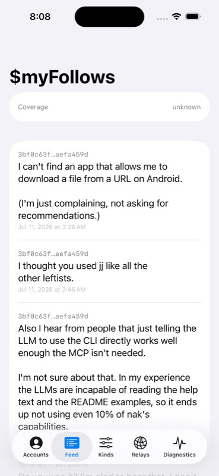
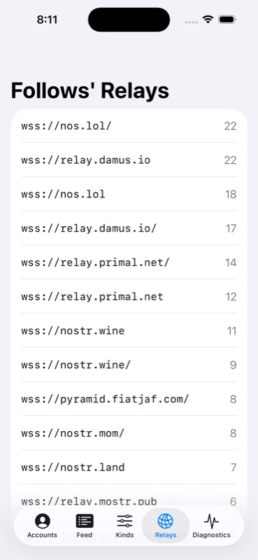

# NMP

**The local-first Nostr engine for apps that want the network machinery, not a new application architecture.**

For Rust, Swift, and Kotlin developers, NMP packages storage, sync, relay routing, durable publication, and diagnostics behind two concepts: **live queries** and **write intents**. The app keeps its state model, UI, identity experience, and product policy.

[](https://github.com/pablof7z/nmp/actions/workflows/ci.yml)
[](LICENSE)

<p align="center">
  
  
</p>

<p align="center"><sub>An ordinary SwiftUI falsifier app backed by NMP. The app owns the screens; NMP owns the live relay work behind them.</sub></p>

## See it work

With [Rust](https://www.rust-lang.org/tools/install) installed:

```bash
git clone https://github.com/pablof7z/nmp.git
cd nmp
cargo run -p nmp-demo -- --secs 20
```

The read-only demo connects to two public indexers, discovers the relevant author relays, streams real events, and finishes with the relay plan and wire activity it observed. No Nostr key is required. This is a running falsifier, not the shape of the public API.

## Why NMP exists

Nostr's wire protocol is small. A dependable local view is not.

As a product moves beyond a single relay request, it can accumulate discovery, routing, subscription repair, deduplication, replaceable-event rules, deletion and expiry, offline persistence, retry, and the question of what the network actually proved. Those concerns are mostly independent of the product's screens and content model.

NMP concentrates that machinery in one embeddable engine. The result is a smaller boundary: the app describes what it needs or what it wants published; the engine owns the distributed work required to keep that intent honest.

## Two nouns

### A live query

A live query describes the app's current demand, including the context needed to decide where and how that data may be acquired. NMP keeps the matching local view current and repairs the underlying relay work when an account, source, or derived input changes.

The app observes the result through its platform's native reactive model. It does not maintain the expanded author set, reopen subscriptions, or mirror a second authoritative cache.

### A write intent

A write intent describes an exact publication obligation and how durable it should be. NMP carries it through local acceptance, signing, relay routing, retry, and per-relay outcomes while preserving one canonical local event state.

The receipt reports observed facts. It does not collapse a distributed publication into a misleading global-success boolean.

### Diagnostics make both explainable

Diagnostics expose the source plan, wire filters, connections, relay evidence, limits, and write attempts behind ordinary query results and receipts. They are a permanent, read-only proof surface—not a debug mode that changes how the engine behaves.

## The ownership boundary

| NMP owns | The app owns | The UI framework owns |
|---|---|---|
| Canonical event and write-obligation storage | App state and architecture | Rendering and layout |
| Relay discovery, routing, sync, and subscription lifecycle | Which queries and writes exist | Observation scope |
| Deduplication, provenance, replacement, deletion, and expiry | Account and identity experience | Navigation and presentation lifecycle |
| Durable publication work and per-relay evidence | Ordering, moderation, formatting, and product policy | Platform presentation details |
| Permanent diagnostics over all of the above | How network evidence is explained to a person | — |

This boundary is the product. NMP can sit inside a small existing app or a full Nostr client without becoming either app's container, reducer, navigation system, or UI policy layer.

Ownership does not require every app to reimplement Nostr content rendering.
The optional [content and UI building-block architecture](docs/design/ui-components-strategy.md)
places reusable parsing, reference sessions, native primitives, and styled
open-code components above the public NMP facade. Apps may adopt, edit, replace,
or omit those layers; NMP Core remains blind to them. This architecture is
designed but not yet implemented.

## What this unlocks

- A view can follow a changing set of authors without app-owned subscription repair.
- Account-dependent data can re-root while unrelated multi-account observations stay live.
- Cached rows can render immediately while relay work continues behind them.
- A pending publication can appear through the same local data path as relay-received events, without an optimistic mirror in app state.
- Protocol-specific behavior can compose with the engine without turning core into a catalog of preferred content types.
- When data is absent or a write stalls, diagnostics can show the scoped evidence instead of inventing a global sync judgment.

## One semantic engine, native platform fit

NMP is built in Rust and projected into Swift and Kotlin so each platform keeps its ordinary observation, cancellation, and state-management patterns. The semantic boundary stays the same across platforms; the app-facing spelling does not need to.

```text
YOUR APP
  state · navigation · product rules · UI
             │
      live queries / write intents
             ▼
NMP
  canonical store · sync · routing · outbox · diagnostics
             │
             ▼
      Nostr relays and signers
```

### The supported surfaces

Rust applications depend on the `nmp` crate and construct `nmp::Engine`. The
lower-level resolver, router, store, transport, and runtime crates are
implementation and repository-test seams, not alternate application APIs.
`nmp-ffi` projects that same facade into Swift and Kotlin through UniFFI
proc-macro metadata; NMP does not maintain a UDL contract.

Public shapes are provisional but governed. Pinned, reproducible Rust
(including the reachable shapes behind dependency-owned explicit reexports)
and UniFFI component baselines
live in [`docs/surface/`](docs/surface/), and every
baseline, native public-wrapper, or consumer package-manifest change requires
an append-only evidence/signoff entry in the
[surface change log](docs/surface-change-log.md).
The steady-state CI judge is loaded from the PR base, not the proposed head.
See the concise
[supported-surface architecture note](docs/architecture/supported-surface.md).

## Correctness is structural

NMP does not treat correctness as a checklist for downstream app code. The supported boundary is shaped so that classes of bad behavior—lost subscriptions, unscoped relay injection, stale replaceable events, signer drift, silent truncation, or false claims of global completeness—can be ruled out at the engine boundary and falsified in tests.

The [bug-class ledger](docs/bug-class-ledger.md) records the mechanism and real proof status for each claim.

## Current status

This README describes the v2 north star. NMP is still pre-v2: the core store, resolver, router, transport, engine, Rust facade, Swift package, Kotlin/JVM package, and falsifier apps exist, while several promoted guarantees remain active work. Public names and shapes are intentionally provisional; the ownership boundary and behavioral invariants are the stable frame.

- [`docs/known-gaps.md`](docs/known-gaps.md) is the honest built-versus-missing record.
- [`docs/bug-class-ledger.md`](docs/bug-class-ledger.md) distinguishes target, partial, and structurally proven guarantees.
- [GitHub Issues](https://github.com/pablof7z/nmp/issues) are the tactical queue.

## Start here

- [Builder guide](docs/builder/README.md) — the product model, examples, and platform guidance.
- [Vision](docs/VISION.md) — the north star and settled behavioral invariants.
- [Design record](docs/design-record.md) — the exploration and decisions behind the architecture.
- [Focused designs](docs/design/) — the deeper contracts for demand, evidence, writes, composition, routing, and bounded delivery.
- [Contributor guide](AGENTS.md) — issue-first workflow and verification discipline.

## Security and trust boundary

NMP runs in the host application and communicates with Nostr relays. It owns local cache and write-obligation state; the app owns identity import, backup, removal, and user-facing trust policy. Production readiness of key handling, secure signer providers, persistence, and reset behavior is tracked explicitly in [known gaps](docs/known-gaps.md)—the north-star description above is not a substitute for that status.

## Contributing

Every unit of work starts with a GitHub issue that captures why it matters and links the relevant invariant when one exists. Read [`AGENTS.md`](AGENTS.md), then choose from the [open issues](https://github.com/pablof7z/nmp/issues).

## License

[MIT](LICENSE)
