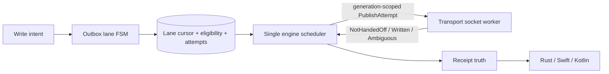

# Single-owner durable retry policy and deadline consumption

## Summary

Make the outbox the sole owner of durable EVENT retry, persist a bounded current-lane cursor, and expose retry deadlines only when one engine scheduler can consume and advance them.

## Boundaries

## Detailed Plan

## Current failure

The attempt table is history-only, engine relay ownership is volatile, and transport retains queued EVENT commands across reconnect. That creates a second publication queue. Adding retry timestamps to `next_deadline()` without a consuming reducer would also busy-loop.

## #93 — transport handoff

Add correlated `PublishAttempt` keyed by attempt identity and connection generation. Results are exactly `NotHandedOff`, `Written`, or `Ambiguous`. EVENT commands never enter reconnect carry-over; REQ preamble behavior stays unchanged. Only `Written` can later become `Sent`. `Ambiguous` emits no `Sent`; Durable awaits ACK, AtMostOnce becomes `OutcomeUnknown`. Prove all classes, rollover, duplicate result, and unchanged reads. No schema/policy in this unit.

## #94 — lane cursor and eligibility

Add bounded, versioned `OUTBOX_LANES`, ordered `OUTBOX_ELIGIBILITY`, and additive `OUTBOX_ATTEMPT_DETAILS`. Keep existing `OUTBOX_ATTEMPTS` v1 rows unchanged so older binaries decode them. Details hold time, handoff, and transient classification. Add policy-free atomic waiting/eligible/in-flight/transient/terminal/close doors.

Idempotent bootstrap inserts missing cursors from open intents, routes, and highest v1 attempt: no attempt becomes waiting connection; terminal maps terminal; Started maps legacy in-flight. Engine converts legacy Durable Started to interrupted/eligible and AtMostOnce Started to `OutcomeUnknown`. No history rewrite.

Crash-test lane creation, start, handoff detail, finish, eligibility, and close. Reads are bounded per #87. Evidence is retained. Downgrade is schema-readable but behaviorally unsafe with open new-lane work, so rollback requires quiescing/closing work or rolling forward.

## #95 — reducer and scheduler

One `schedule_ready(now)` runs after boot, tick, connection/AUTH change, handoff, OK, disconnect, cancellation, and persistence recovery. Stable order is `(eligible_at, intent, relay)`. Caps are 32 global/1 relay. Backoff is 3,6,12 seconds to 300 plus deterministic 0..<5-second jitter; ACK timeout is 30 seconds. Offline/AUTH consume no attempt/deadline.

`NotHandedOff` emits no `Sent` and may safely re-arm either durability. Persist `Written` before `Sent`, then await ACK. `Ambiguous` emits no `Sent`; Durable awaits ACK then retries after timeout, AtMostOnce immediately becomes `OutcomeUnknown`. Durable retries use a new ordinal. Tick consumes due eligibility/ACK deadlines before returning the next deadline; when caps are full, completion messages wake work.

Classify standardized NIP-01 plus NIP-42 prefixes only: `duplicate` -> Acked; `rate-limited`/`error` -> transient; `auth-required` -> WaitingAuth; `invalid`/`pow`/`blocked`/`restricted`/`mute` -> terminal Rejected. Unknown/malformed -> terminal Rejected with raw reason. Tests cover every class/default, timing equality, caps/fairness, restart determinism, no polling, no hidden queue, persistence failures, exact bytes/ordinals, and bounded ticks.

## #96 — governed receipt projection

Add `AwaitingRelay`, `AwaitingAuth`, `RetryEligible`, and `HandoffAmbiguous`; emit `Sent` only after persisted `Written`. Keep write retry truth separate from query evidence. Update Rust facade, UniFFI, Swift, Kotlin, direct/FFI parity, exhaustive mappings, snapshots, and exact change-log entry.

## Coordination and acceptance

#87 is merged. Prefer #88 before #95/#96. #86 may rebase independently. #8 owns AUTH negotiation; #49 query evidence and #51 diagnostics remain separate. #81 is admin-only. Completion requires crash/no-spin/scale falsifiers plus workspace, Swift, Kotlin, regeneration, and governance gates.

## Rule And ADR Check

- Complies with AGENTS.md issue-first discipline through parent #79 and children #93–#96.
- Complies with VISION section 3.3 and bug-class ledger #16: transport owns sockets, outbox owns durable attempts, one engine scheduler owns retry time and caps.
- Complies with the crash-safe Accepted correction: retry deadlines enter next_deadline only with the transition that consumes them.
- Complies with store boundaries: persistence enforces atomic facts; engine owns policy.
- Complies with surface governance: #96 updates every platform, snapshots, parity, and change log together.

## Possible Rule Or ADR Loosening

- No rule should be loosened. Transport must not regain an implicit durable EVENT queue, and failed persistence must not produce wire or terminal facts.

## Possible Rule Tightening

- Require every deadline source to name the state transition that consumes and advances it.
- Require every durable handoff to be correlated, generation-scoped, and classified as NotHandedOff, Written, or Ambiguous.

## Alternatives Considered

- Reuse transport reconnect backoff: rejected because it creates duplicate publication ownership.
- Reconstruct current state by scanning attempt history: rejected as unbounded and crash-fragile.
- Add deadlines before the reducer: rejected because past-due values would busy-loop.
- Expose waits only in diagnostics: rejected by owner decision; receipts carry them now.
- Prune terminal history here: rejected; retained evidence needs a separate explicit GC policy.

## Certainty

94 percent.

## Decision

ready

## Hosted Artifacts

- Plan page: https://pablof7z.github.io/nmp/plans/durable-retry-policy-79/

- TTS audio: https://blossom.primal.net/d0b0b572b4fbb4337ba29424bace040722822a037b5c1c5335b5199e773da564.mp3
