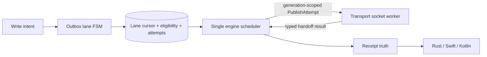

# Single-owner durable retry policy and deadline consumption

## Summary

Make the outbox the sole owner of durable EVENT retry, persist a bounded current-lane cursor, and expose retry deadlines only when one engine scheduler can consume and advance them.

## Boundaries

## Detailed Plan

## Authority and current failure

Parent #79 and epic #23 define one owner for durable retry. Today the attempt table is history-only, the engine has volatile relay sets, and transport can retain queued EVENT commands across reconnect. That combination creates a second hidden publication queue. `next_deadline()` currently consumes only expiration and negentropy; adding retry timestamps alone would create a past-due busy loop.

## Unit #93 — transport handoff ownership

Add a correlated `PublishAttempt` command keyed by persisted attempt identity and connection generation. Add a typed result distinguishing proven not handed off from written or ambiguous. Durable EVENT commands must be dropped and reported at generation end; they never enter the reconnect carry-over deque. Keep REQ/subscription preamble replay unchanged. Prove rollover, disconnect-before-write, ambiguity, duplicate result, and unrelated read traffic.

Rollback: the PR is an internal seam and can be reverted before #95 consumes it. No persistence migration.

## Unit #94 — durable lane cursor and eligibility index

Add versioned `OUTBOX_LANES` keyed by length-prefixed `(intent, relay)` and ordered `OUTBOX_ELIGIBILITY` keyed by `(eligible_at, intent, relay)`. Add policy-free atomic doors for waiting, eligible, in-flight, transient, terminal, and terminal-intent-close transitions. Attempt v2 records add times/outcome detail; v1 decodes without rewrite. Offline and AUTH waits have no eligibility row. All reads are bounded/indexed, using #87's discipline.

Crash matrix: before/after lane creation, attempt start, terminal/transient finish, eligibility update, and open-intent close. Memory and Redb must be identical. Corruption fails closed and never deletes obligations. Retain receipts, routes, lanes, and attempts as evidence after open-work closure.

Rollback: schema additions are versioned and additive; old binaries ignore new tables, while the new decoder accepts v1. Do not destructively migrate history.

## Unit #95 — engine reducer and scheduler

Use typed states `WaitingConnection`, `WaitingAuth`, `Eligible`, `InFlight`, and terminal outcomes. One `schedule_ready(now)` path runs after boot, tick, connection/AUTH change, handoff result, OK, disconnect, cancellation, and persistence recovery. Stable order is `(eligible_at, intent, relay)`. Enforce 32 global and 1 per relay. Backoff is 3, 6, 12 seconds up to 300 seconds plus deterministic 0..<5-second jitter derived from persisted attempt identity. ACK timeout is 30 seconds.

Only actual committed starts consume an ordinal. Offline/AUTH waits consume none. Durable interrupted or ambiguous attempts finish transient and later dispatch under a new ordinal. AtMostOnce proven-not-handed-off may re-arm; written/ambiguous becomes `OutcomeUnknown` and never re-enters eligibility. Tick must consume due eligibility and ACK deadlines before computing the next deadline; when capacity is full, completion messages—not a zero deadline—wake scheduling.

Falsifiers cover no-deadline blocking, exact equality, cap-full past-due work, stable fairness, deterministic reopen, no polling, no hidden transport queue, persistence failure at every transition, exact bytes/ordinals, and bounded tick/effect counts.

## Unit #96 — governed receipt projection

Add `AwaitingRelay`, `AwaitingAuth`, and `RetryEligible` plus ordinal/timing where required to canonical receipt facts. Do not call queue acceptance `Sent`. Keep write retry truth distinct from query acquisition evidence. Update facade, UniFFI, Swift, Kotlin, direct-vs-FFI parity, exhaustive native mappings, both snapshots, and the exact append-only surface entry.

## Dependencies and coordination

#87 is merged. Prefer #88 before #95/#96 so corrupt retained evidence is typed. #86 may land independently but must rebase around core changes. #8 owns AUTH negotiation; #95 adds only the waiting/wake seam. #49 query evidence and #51 diagnostics remain separate. #81 requires repository-admin configuration and is not an implementation gate.

## Observability and acceptance

Receipts expose every wait/retry transition. Attempt history preserves exact ordinals, timestamps, handoff classification, and outcomes. Tests assert the scheduler's visited/due work is bounded and the runtime blocks rather than polls. Completion requires all child PR tests plus workspace, Swift, Kotlin, surface regeneration, and trusted governance gates.

## Rule And ADR Check

- Complies with AGENTS.md issue-first discipline through parent #79 and children #93–#96; each implementation unit maps to one cohesive PR.
- Complies with VISION section 3.3 and bug-class ledger #16: transport owns sockets, outbox owns durable attempts, and one engine scheduler owns retry time and caps.
- Complies with the crash-safe Accepted plan correction: retry deadlines enter next_deadline only in the same unit as the transition that consumes and advances them.
- Complies with current store boundaries: persistence enforces atomic facts while the engine owns classification and policy.
- Complies with surface governance: #96 updates every platform, snapshots, parity tests, and the append-only change log together.

## Possible Rule Or ADR Loosening

- No existing rule should be loosened. In particular, transport must not regain an implicit durable EVENT queue, and failed persistence must not produce wire or terminal facts.

## Possible Rule Tightening

- Consider adding a durable rule that every deadline source must name the state transition that consumes and advances it.
- Consider requiring every durable transport handoff to be correlated, generation-scoped, and classified as proven-not-handed-off or ambiguous.

## Alternatives Considered

- Reuse transport reconnect backoff as publication retry policy: rejected because it creates duplicate ownership and cannot preserve attempt ordinals or AtMostOnce ambiguity.
- Reconstruct current retry state by scanning attempt history: rejected because it is unbounded, complicates crash truth, and conflicts with #87's indexed-range discipline.
- Add retry timestamps to next_deadline before the reducer exists: rejected because a past-due value would wake repeatedly without advancing state.
- Expose waits only in diagnostics: rejected by owner decision; receipts now carry AwaitingRelay, AwaitingAuth, and RetryEligible truth across all SDKs.
- Prune terminal history in the retry implementation: rejected; open working rows close, but retained evidence waits for an explicit GC policy.

## Certainty

94 percent.

## Decision

ready

## Hosted Artifacts

- Plan page: https://pablof7z.github.io/nmp/plans/durable-retry-policy-79/

- TTS audio: https://blossom.primal.net/9d5222f80bb04ad33cb2372964b4cdca5793a5d21f1b255f94860596b5f71e8d.mp3
