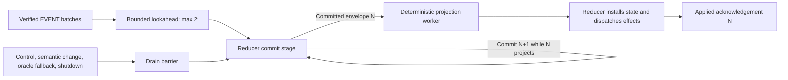

# Bounded commit and projection overlap for issue 688

## Summary

Exploit the measured serial reducer bottleneck by overlapping one safe committed projection with the next event-store batch, without weakening ordering, visibility, or bounded backpressure.

## Boundaries

## Detailed Plan

## Objective

Turn the measured resolver/store-plus-projection serialization into a bounded 2-stage pipeline for the dominant ordinary relay-ingest path. Preserve the exact public semantics and keep only a measured multiplier-sized gain.

## Measured basis

The #686 active window was 1,168.8 ms. Engine batch processing occupied 1,102.3 ms and the pool bridge waited 1,106.2 ms for applied acknowledgements. Resolver/store mutation occupied 646.4 ms wall; committed mutation application occupied 272.8 ms. Perfect overlap is not achievable because of fill, drain, and barrier batches, but the removable serialized slice is large enough to justify one architecture candidate.

## Ownership model

Extract the complete live/history projection maps needed by the ordinary exact path into an internal `ProjectionState`. Ownership is always one of two typed states: ready in the reducer or in flight with an exact sequence. Do not use a lifecycle boolean or shared mutable state.

A single persistent projection worker owns a bounded job receiver and result sender, each capacity 1. A job owns `ProjectionState`, the immutable committed row changes, affected handle/history identities, and the sequence. It performs only deterministic, store-read-free exact projection. It returns the updated state and ordered effects. It never dispatches callbacks, touches the pool, acknowledges a batch, or accesses the store.

The reducer remains the authority that installs returned projection state, applies relay-specific post-store facts in sequence, dispatches effects, and sends `applied`. This keeps all externally observable ordering at the existing authority boundary.

## Commit/projection split

Refactor relay ingest without changing store semantics:

1. Commit stage: validate current transport/session facts, prepare observed rows, call the existing resolver/store batch mutation, and build an owned `CommittedRelayEnvelope` with a monotonic sequence. No row/evidence effect is emitted here.
2. Eligibility stage: inspect the complete envelope and current projection state. Only stable-demand, stable-directory, no-pending-adoption, store-read-free exact projection enters the worker.
3. Projection stage: move projection state and the eligible envelope into the worker.
4. Lookahead stage: while projection N runs, accept at most one consecutive ordinary EVENT batch and execute its commit stage. Do not process app commands, scalar/control frames, or a third batch.
5. Publication stage: receive N, verify its sequence, restore projection ownership, apply ordered relay-specific facts, dispatch its effects, then acknowledge N. Continue with the already committed N+1 envelope.

If N+1 proves ineligible after commit, that is safe: its facts are durable but unobservable behind N. After N is fully applied, process N+1 through the existing synchronous barrier path before handling later commands.

## Bridge protocol

Replace the bridge's one-send/one-wait loop with a fixed window of at most 2 consecutive event batches. Retain an applied receiver per batch and retire them strictly FIFO. The bridge must drain all outstanding acknowledgements before forwarding a non-batch pool event. Engine inbox capacity remains bounded and is not bypassed.

Instrument outstanding-batch high-water mark, projection jobs, overlap wall time, barrier counts by reason, queue wait, and sequence lag. The benchmark must prove actual overlap rather than infer it from throughput.

## Fail-closed barriers

Use the current synchronous reducer path after draining whenever any of these applies:

- resolver demand delta or router recompilation;
- NIP-65 directory winner change;
- local pending intent adoption or compensation interaction;
- removal/backfill/fallback that may query the store until a store-free proof exists;
- incomplete live or history projection;
- scalar control, lifecycle, AUTH, EOSE/NEG, tick/deadline, subscribe/unsubscribe, publish, signer completion, or shutdown;
- degraded store or worker/channel failure.

Worker failure is terminal for pipelining, not correctness: restore or fail closed before acknowledging, disable the fast path, and continue only if projection state remains authoritative. Never reconstruct missing state by guessing.

## Correctness falsifiers

Add deterministic tests for:

- stage-1 N+1 overlap while N projection is deliberately blocked;
- FIFO visible deltas and FIFO applied acknowledgements;
- capacity saturation backpressure with no dropped send;
- control frame and app-command drain barriers;
- demand, directory, pending-adoption, incomplete-projection, and store-read fallback barriers;
- commit failure producing neither projection nor applied;
- worker failure and disconnect behavior;
- shutdown before submit, during projection, after N+1 commit, and before applied;
- insert/remove/replace/delete/expiry ordering and Redb exact reopen;
- thread baseline returning exactly after repeated spawn/shutdown.

Retain the existing forced-full-refresh and MemoryStore/Redb oracle suites as semantic comparators.

## Performance validation

Freeze a fresh schema-v21 baseline on the merged parent. Run a small diagnostic first and require nonzero overlap with sequence/order assertions. Then run five alternating fresh-process pairs for MemoryStore and durable Redb on the representative 100,000-event corpus.

Retain only with median paired complete throughput at least 10% better for MemoryStore and 5% better for Redb, peak RSS no more than 10% worse, exact expected frames/rows/provenance, and exact Redb reopen. Record reducer CPU, projection CPU, overlap time, queue wait, allocation bytes, process writes, first-row latency, and barrier distribution.

Profile the retained candidate's exact completion window to confirm the reducer's serial samples and bridge applied wait shrink. If the gate fails, revert all production pipeline code and merge only evidence that makes the negative reusable.

## Rollout and rollback

This is an internal runtime replacement with no migration or FFI surface. Land behind no permanent feature flag: the candidate either passes and replaces the old ordinary-batch scheduler, or is reverted. Keep the synchronous barrier path as the correctness oracle and operational fallback.

Rollback is a normal code revert because store format and durable facts do not change. A store written by the candidate must reopen unchanged on the parent implementation.

## Open questions to resolve during implementation

- Precisely which insert-only and provenance-growth row-change shapes are provably store-read-free for every complete live/history projection?
- Can projection state be extracted without moving router/evidence authority, or should a smaller `ExactProjectionState` be introduced?
- Does processing N+1 commit mutate resolver graph facts needed by N's relay-specific post-store step? If yes, snapshot those facts in N's envelope or narrow eligibility further.
- Does depth 2 maximize overlap, or do measured batch sizes require a different fixed bound? Start at 2; raising it needs separate evidence and stronger memory bounds.

## Rule And ADR Check

- Issue-first discipline is satisfied by #688, linked to epic #612 and the merged #686 profile evidence.
- The VISION live-query contract is preserved: query deltas remain post-commit facts, and applied remains stronger than durable commit.
- The bounded-delivery doctrine is preserved with a fixed one-job projection lane, bounded lookahead, and backpressure on saturation.
- The architecture review gates are preserved: no public noun, no lifecycle bool, no destructive API, and no FFI surface change.
- Event-store-local atomicity, Redb single-writer ordering, provenance, replacement, deletion, expiry, and exact reopen semantics remain unchanged.

## Possible Rule Or ADR Loosening

- No product or persistence rule needs loosening.
- The current implementation convention that the pool bridge waits for every applied acknowledgement before offering another event batch is intentionally replaced by a bounded lookahead protocol; the stronger semantic rule that applied follows ordered projection is retained.

## Possible Rule Tightening

- Add an internal rule that every asynchronous commit/projection lane defines a monotonic sequence, a bounded capacity, explicit drain barriers, and the exact point at which applied may fire.
- Represent temporary projection ownership with an enum or Option::take-style transfer so projection-dependent methods are mechanically unreachable while state is in flight.

## Alternatives Considered

- Move the entire ResolverEngine and store to a dedicated command thread. This gives clean ownership but forces every query, write, coverage, and graph operation through a much larger RPC boundary before the common path proves the benefit.
- Move all live/history projection authority permanently to another thread. This creates a broader synchronization surface for subscribe, unsubscribe, evidence, router recompilation, and store-oracle fallbacks than the one-batch functional worker needs.
- Parallelize only history materialization. The #686 candidate already reduced history work substantially but improved complete MemoryStore throughput only 3.7% and regressed Redb.
- Change Redb, Fjall, or LMDB. The exact active bottleneck also exists with MemoryStore, so a physical database cannot remove this serial dependency.
- Acknowledge at commit and project later. Rejected because it weakens the current applied and query-visibility contract.

## Certainty

82 percent.

## Decision

ready

## Hosted Artifacts

- Plan page: https://pablof7z.github.io/nmp/plans/issue-688-commit-projection-overlap/

- TTS audio: https://blossom.primal.net/37336ecb45fafb798780ece161a7b103fb2eea42db512f0126aca515844b5a28.mp3
