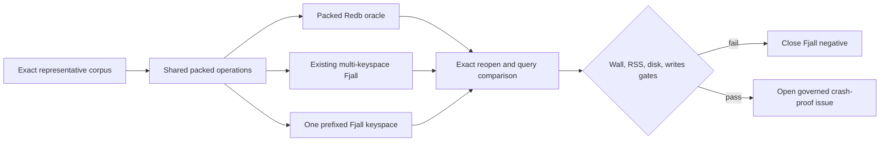

# One-keyspace Fjall packed ceiling

## Summary

Test whether one prefixed Fjall partition preserves the measured write reduction without the wall, memory, and disk costs of the rejected multi-keyspace layout.

## Boundaries

## Detailed Plan

## Objective

Determine whether Fjall's rejected result belongs to Fjall itself or to NMP's many-partition physical mapping. Test one transactional partition with typed logical-table prefixes before spending any work on a production backend.

## Stage 1: exact packed-only adapter

Extend the existing packed-postings benchmark with a third backend mode, `FjallOneKeyspace`. Keep the current packed Redb and multi-keyspace Fjall implementations unchanged as same-binary controls.

Open one `SingleWriterTxKeyspace`. Define an internal `PackedTablePrefix` enum with one stable nonzero byte for dictionaries, dictionary IDs, segments, run metadata, death blocks, and any benchmark metadata. Keys are `prefix || existing_key`; values remain byte-identical. Numeric material remains big-endian. A range helper returns exact lower and exclusive upper bounds for one prefix and rejects prefix exhaustion. No caller assembles raw prefixes.

Use one Fjall write transaction and `PersistMode::SyncAll` for every existing transaction cohort. Reuse the exact run allocator, 8/6 fan-in selection, codecs, deletion overlay, synchronous NMP compaction, query probes, and reopen reconstruction. Do not tune compression, bloom filters, memtable sizes, workers, or batch sizes differently between Fjall modes in the first matrix; the physical partition count is the only independent variable.

## Correctness falsifiers

Add tests that:

- round-trip every logical table through the prefix codec;
- prove sorted range scans return only the selected logical table, including empty, minimum, maximum, and adjacent prefixes;
- compare every reopened dictionary, segment, run, death block, and live membership with packed Redb;
- preserve `created_at DESC, event_id ASC`, exclusive cursor behavior, and the existing selective query samples;
- exercise small-batch compaction and deletion overlay through the one-keyspace path;
- prove a failed transaction exposes neither a partial packed run nor partial catalog publication.

## Maintenance and observability

Report foreground transaction time separately from NMP packed compaction and Fjall maintenance. After foreground completion, force/persist all eligible work, wait for Fjall to reach a documented quiescent state, and include that wall in the deciding maintenance-inclusive result. Record remaining L0/SST counts or the closest stable Fjall metrics, worker threads, process writes, logical/stored bytes, peak RSS, allocation bytes, open/reopen time, commit percentiles, and selective query p50/p95. If Fjall exposes no exact debt API, define and test the conservative quiescence procedure rather than assuming database drop pays it.

## Measurement matrix

Build one release evidence binary with exact source and binary digests. Run at least 10 balanced fresh-process triplets on the same filesystem and committed representative 100,000-event corpus. Rotate Redb, multi-keyspace Fjall, and one-keyspace Fjall order rather than always warming one backend first. Each child uses a fresh database and verifies exact reopen before success.

Use paired or within-triplet changes against Redb as the decision statistic. Also report the direct one-keyspace versus multi-keyspace delta to answer the physical-layout hypothesis. Preserve raw JSON without normalization.

## Gates and stop boundary

Retain only benchmark code and select a follow-up if one-keyspace Fjall reduces maintenance-inclusive store wall at least 20%, projects at least 10% complete-pipeline improvement, keeps RSS/stored bytes/open/query p95 within 10%, preserves or reduces process writes, and has no maintenance debt or correctness difference.

If the packed-only mode fails any gate, revert the candidate code if it has no reusable measurement value, commit the negative evidence, close #691, and mark Fjall rejected for the current packed representation. Do not build a governed adapter or million-event run.

If it passes, this issue still does not ship Fjall. Open a separate governed mutation-rich issue covering canonical state, provenance, replacement, kind-5, expiry, coverage ordering, outbox authority boundaries, forced-exit seams, native packaging, and selective query behavior.

## Rollback and migration

There is no migration or rollout. The mode is benchmark-only behind existing bench instrumentation. Rollback is deletion of the candidate adapter; production Redb files and APIs are untouched.

## Risks and open questions

- Confirm the Fjall version's strongest documented quiescence mechanism and whether SyncAll covers the single-partition transaction plus manifest state expected by reopen.
- Confirm whether one large partition changes bloom/index amplification enough to harm selective packed queries even if ingest improves.
- Confirm process-write accounting includes all worker activity through quiescence.
- If one-keyspace fixes wall but not the 3.5x disk gap, stop under the existing gate rather than inventing a compression change in the same experiment.

## Rule And ADR Check

- Issue-first discipline is satisfied by #691, linked to epic #612 and the prior Fjall evidence in #629, #635, and #655.
- The experiment is benchmark-only and preserves the existing event-store atomicity, exact reopen, packed ordering, bounded maintenance, and durability requirements.
- No public noun, FFI concept, lifecycle boolean, destructive API, or application architecture boundary changes.

## Possible Rule Or ADR Loosening

- No product or persistence rule needs loosening.
- A result that wins only by leaving background compaction debt, weakening SyncAll durability, or relaxing exact reopen is a failure rather than a rule exception.

## Possible Rule Tightening

- Require future LSM backend comparisons to report per-partition physical overhead and fully quiescent maintenance, not only foreground writes.
- Require logical-table prefix codecs to expose typed range bounds and a cross-table leakage falsifier before they can own persisted data.

## Alternatives Considered

- Repeat the existing multi-keyspace Fjall matrix: rejected because its wall, RSS, and disk costs are already measured and the hypothesis is unchanged.
- Build a full one-keyspace Fjall EventStore immediately: rejected because the packed-only matrix can kill the physical-layout hypothesis much more cheaply.
- Migrate to LMDB: the exact packed ceiling already projected a useful gain but failed the RSS gate by a wide margin.
- Keep Redb without testing: safe, but it would discard the measured Fjall write-endurance signal without testing the one materially different layout that could address its known overhead.

## Certainty

91 percent.

## Decision

ready

## Hosted Artifacts

- Plan page: https://pablof7z.github.io/nmp/plans/issue-691-one-keyspace-fjall-packed-ceiling/

- TTS audio: https://blossom.primal.net/228f9d9528f83105526377fc4f461c3e07abd883ed4ca23e03b14f5f31bd71d4.mp3
