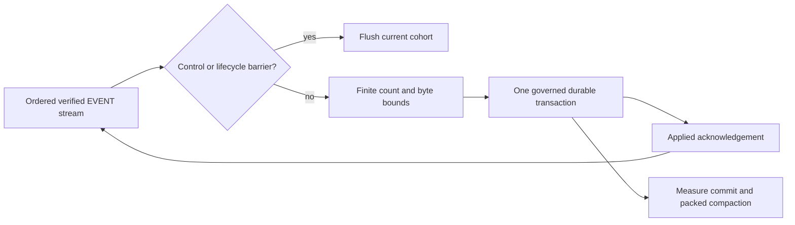

# Larger crash-atomic ingest cohorts

## Summary

Test whether larger finite EVENT cohorts reduce Redb commit and packed-compaction cost enough to move epic #612 without weakening durability or latency bounds.

## Boundaries

## Detailed Plan

## Objective

Determine whether the existing 4,096-event transaction ceiling leaves material durable Redb throughput on the table, and retain exactly one larger finite ceiling only if the complete production path improves without violating memory, latency, replay, or recovery gates.

## Stage 1: configuration-only ceiling matrix

Build one release `relay_ingest_bench` from a clean commit. Run fresh-process controls at 4,096, 8,192, and 16,384 maximum EVENT frames with the existing representative 100,000-event corpus. Keep the 8 MiB batch-byte ceiling, 200 us wait, 8 verifier workers, 512 verification batch, 8,192 queue capacities, 200-row visible window, synchronous Redb durability, and all runtime code identical.

Rotate the 3 cohort sizes over at least 5 repetitions for durable Redb, then repeat the selected control/candidate pair with MemoryStore. Preserve raw JSON. Use paired within-repetition changes for the decision.

Add or expose benchmark attribution only if current fields cannot report actual bridge/store batch count and maximum, Redb commit, packed-postings publication and compaction, complete throughput, first row, RSS, allocations, writes, and exact reopen. Attribution must not change ordinary builds.

## Stage 2: production candidate

If neither larger ceiling clears the stage-1 throughput gate, stop and revert any instrumentation without reusable value.

If one wins, change only `PoolConfig::default().max_engine_batch` to the smallest passing ceiling. Do not change the byte bound, wait, queue sizes, verifier shape, or durability. Preserve the existing assembler: only consecutive EVENT frames coalesce; every control frame and lifecycle event ends the cohort; the bridge waits for the applied acknowledgement before advancing.

Focused falsifiers must cover the selected count ceiling, byte-bound splitting below the count ceiling, control and lifecycle barriers, isolated-event latency, bounded backpressure, stopping while awaiting apply, and exact event order.

## Stage 3: qualification

Run at least 5 clean Redb pairs and 5 MemoryStore pairs with baseline and candidate binaries. Required gates:

- at least 10% paired-median Redb completion-throughput improvement;
- no more than 5% MemoryStore throughput regression;
- no more than 10% peak-RSS or first-row regression;
- duplicate replay median remains at least 500,000 frames/s;
- process writes and commit/compaction attribution explain the mechanism;
- every 100,000-event run reopens exactly.

Then run the selected candidate at one million events. It must observe, commit, and reopen exactly one million events with no accepted-but-lost work and remain inside the epic RSS allowance. The persistence format and query implementation are unchanged, so existing selective-query results remain authoritative; any unexpected query or open-path difference is a failure requiring direct remeasurement.

## Rollback

The rollback is one internal default plus benchmark-only attribution. If any gate fails, revert the candidate before merge and retain only the raw matrix, manifest, and decision summary. No store migration or compatibility path exists.

## Risks and open questions

- A larger cohort may reduce commit count but increase per-transaction dirty pages enough to erase the gain.
- The 200 us wait may prevent larger cohorts from forming; observed batch maxima and distributions decide whether that is the mechanism, not the configured number.
- Packed run geometry may improve at 100,000 events but shift compaction spikes or memory at one million; the scale run is mandatory.
- The 8 MiB byte ceiling may become the actual bound on tag-heavy events. That is expected and remains a safety property, not a reason to raise it in this issue.

## Rule And ADR Check

- Issue #694 captures the consequence and links the work to epic #612 before implementation.
- The candidate preserves bounded queues, the finite byte ceiling, control/lifecycle barriers, ordered applied acknowledgement, and one crash-atomic transaction per admitted cohort.
- No public noun, FFI projection, persistence schema, destructive API, or migration changes; architecture gates 1 through 4 are unaffected and gates 5 through 6 still run.

## Possible Rule Or ADR Loosening

- No rule or durability invariant needs loosening. Non-durable group commit is explicitly excluded even though #658 measured it as favorable.

## Possible Rule Tightening

- Consider requiring future changes to a production batching ceiling to report the observed batch distribution and adjacent-size controls, not only the configured maximum.

## Alternatives Considered

- Redb non-durable foreground commits plus a checkpoint: faster in #658 but can lose accepted foreground work and is not shippable.
- Overlap commit with projection: #688 proved the mechanism but measured only a 2.3% durable gain and reverted it.
- Migrate to LMDB or Fjall: the exact candidates failed RSS or wall/write/query gates in #658 and #691.
- Increase the byte ceiling together with the count ceiling: rejected because it confounds the experiment and weakens the existing memory bound.

## Certainty

88 percent.

## Decision

ready

## Hosted Artifacts

- Plan page: https://pablof7z.github.io/nmp/plans/issue-694-larger-crash-atomic-ingest-cohorts/

- TTS audio: https://blossom.primal.net/d5152218daa64c284558db90e0e5896199ab22b715955e67362c6d06949ffdea.mp3
