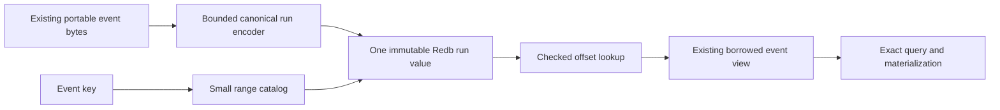

# Immutable canonical event runs

## Summary

Test whether packing byte-identical canonical event values into bounded immutable Redb runs removes per-event copy-on-write work without larger engine batches or query/recovery tradeoffs.

## Boundaries

## Detailed Plan

## Objective

Measure whether per-event canonical Redb values are a material remaining copy-on-write owner after packed postings, without changing engine cohort size, durability, ID lookup, provenance representation, or NIP-01 bytes.

## Codec and physical layout

Add a benchmark-only canonical-run codec in a focused module rather than expanding the packed benchmark into another monolith. A run contains a fixed magic/version header, run id, minimum and maximum event keys, event count, a monotonic `count + 1` offset directory, and one dense arena of the existing `binary_event::encode_event` values. Numeric fields are fixed-width big-endian.

`CanonicalRunView::parse` validates magic, version, reserved bytes, count/length arithmetic, monotonic offsets, first offset zero, final offset equal to arena length, contiguous key range, and every selected event slice through the existing borrowed event parser. Truncation, trailing bytes, offset overlap, range overflow, and malformed nested event bytes fail closed.

Use one benchmark Redb table keyed by run id for values and a small `min_event_key -> run_id/max_event_key` catalog. Event-key lookup performs one predecessor range lookup, validates containment, then returns the exact event slice. Keep `EVENT_IDS`, `EVENT_OBSERVATIONS`, relay tables, packed dictionaries/segments/death blocks/catalogs, cardinality, and transaction durability unchanged. The control remains current packed Redb.

## Correctness falsifiers

- round-trip empty-forbidden, one-event, full-batch, and variable-sized event runs;
- reject every truncation boundary, trailing bytes, non-monotonic/out-of-range offsets, wrong run id/range, and malformed nested event values;
- prove first/last/exact-boundary/missing event-key lookup;
- compare event-ID lookup, borrowed filter matching, full materialization, and all selective query results with packed Redb;
- apply the existing deterministic deletion wave and prove live IDs/memberships after reopen; dead bytes retained in a run remain counted as storage;
- force process exit after one committed run/catalog/ID/index transaction and after staging the next, then reopen to exactly the committed state.

## Measurement

Extend the fresh-process packed matrix with `packed_redb_canonical_runs`. Run at least 10 alternating pairs over the committed representative 100,000-event corpus at the current 4,096-event batch and Immediate durability. Values fed to packed postings and canonical runs must be byte-identical to control values.

Report foreground wall, deletion, mandatory compaction, maintenance-inclusive wall, run build/insert, canonical bytes/rows, Redb commit, process writes, logical/stored/allocated bytes, peak RSS, allocations, open/reopen, exact live IDs/memberships, and existing query p50/p95. Preserve raw JSON and binary/corpus digests.

## Gates and stop boundary

Proceed only if paired medians show at least 20% lower maintenance-inclusive store wall, enough to project at least 10% complete-pipeline improvement using the latest governed store share; process writes do not increase; and RSS, stored bytes, reopen, and every query p95 remain within 10%. Correctness must be exact in every run.

If any gate fails, commit the adapter for reproducibility, commit evidence, then revert the adapter from the final tree. Do not implement observation overlays, local pending-row handling, migration, or one-million scale.

If all gates pass, this issue still ships no backend. Open a governed follow-up covering mutable observations, local state, replacement, deletion, expiry, GC/reclamation, coverage, pending writes, migration, forced-exit seams, one-million scale, and the full production relay path.

## Rollback and migration

There is no production migration. Rollback is removal of the benchmark backend. Existing Redb files and APIs are untouched.

## Risks and open questions

- Large Redb values may use overflow pages efficiently enough that removing B-tree keys provides little gain.
- Retained dead event bytes may exceed the stored-byte gate before a governed reclamation design is justified.
- One catalog predecessor lookup plus run parsing may regress selective event materialization; the query matrix decides.
- If the event run wins only by caching decoded directories across queries, that cache must be bounded and included in RSS before proceeding.

## Rule And ADR Check

- Issue #696 captures the consequence before implementation and links the work to epic #612.
- The experiment preserves the existing portable event codec, exact event IDs, packed ordering, synchronous Redb transaction boundary, and facts-before-claims recovery rule.
- No public noun, FFI/SDK surface, production schema, migration, or destructive API changes in this benchmark-only issue.

## Possible Rule Or ADR Loosening

- No correctness or durability rule needs loosening. Dead canonical bytes remaining inside immutable runs count against stored-byte and maintenance gates rather than being hidden.

## Possible Rule Tightening

- Consider requiring future immutable-run formats to publish a checked offset-directory codec plus corruption and range-boundary falsifiers before performance qualification.

## Alternatives Considered

- Pack event IDs as well: deferred because retaining the exact point-lookup table isolates canonical-value row cost and avoids conflating lookup design.
- Pack mutable relay observations in the first stage: deferred because provenance updates require a separate overlay/compaction policy; event values are immutable and provide the cheaper falsifier.
- Append canonical bytes to a second file: rejected for stage 1 because it introduces a cross-file recovery protocol before proving the row-shape ceiling.
- Increase transaction size again: #694 reduced commit cost but failed throughput and RSS gates.

## Certainty

84 percent.

## Decision

ready

## Hosted Artifacts

- Plan page: https://pablof7z.github.io/nmp/plans/issue-696-immutable-canonical-event-runs/

- TTS audio: https://blossom.primal.net/4efe0dbffe5fbb84b6cb2f55caff4b6ab0dbfbf06401acd50380249664910fbc.mp3
