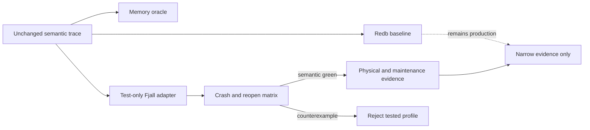

# Fjall semantic and maintenance qualification

## Summary

Run Fjall through the unchanged event-and-publishing semantic oracle, prove every durable boundary with process death and reopen, then measure foreground and fully accounted maintenance separately. Redb remains the production baseline.

## Boundaries



## Detailed Plan

## Objective

Determine whether the existing multi-keyspace Fjall profile can preserve NMP's complete event-store and publishing semantics under durable reopen and process death, then measure its full maintenance cost. The experiment may reject that profile or keep Fjall open. It cannot select or ship a backend.

## Dependency gate

PR #729 changes coverage shrink behavior at the maximum timestamp and touches an oracle-owned invariant. Do not begin adapter edits until that exact fix lands on master. Rebase the implementation branch on the merged commit before changing storage code.

## Fixed candidate profile

- Pin `fjall = 3.1.6` with default LZ4 features, as already locked.
- Use `SingleWriterTxDatabase` and one `WriteTransaction` per semantic mutation.
- Set transaction durability to `PersistMode::SyncAll`.
- Start from the existing governed multi-keyspace mapping in `fjall_ingest_bench.rs`; do not substitute the rejected one-keyspace packed-postings experiment from #691.
- Keep every candidate type and constructor behind `bench-instrumentation` plus test/evidence-only module reachability.
- Do not add Fjall to any engine constructor, FFI surface, native SDK, WASM graph, migration path, or schema negotiation.

## Stage 1: backend-independent harness seam

Refactor `semantic_oracle.rs` only enough to describe an opener/reopener that returns a private `dyn EventStore`. Keep the operation trace, normalized state, ordered query assertions, recovery projection, and BLAKE3 digest construction byte-for-byte shared.

Add a feature-enabled qualification test that runs the same fixture through MemoryStore, RedbStore, and the Fjall candidate. Ordinary `cargo test -p nmp-store` must remain Fjall-free. A compile/check command without `bench-instrumentation` must prove the candidate cannot be named or constructed.

## Stage 2: complete experimental EventStore

Extend the Fjall keyspace bundle to cover canonical events, id lookup, provenance, address winners, tombstones, expiry, coverage, query indexes, intent and receipt authority, displaced rows, correlation, route revisions, lanes, deadlines, attempts, handoff detail, suppression, and counters.

Reuse `insert_with_tables`, `mutation`, coverage helpers, event codecs, ordering definitions, and outbox state transition rules. Extract backend-neutral policy functions when a decision is currently embedded in Redb table code. Backend-specific code may encode, scan, and transact, but must not decide different semantics.

Every mutating EventStore method used by the oracle must either:

1. commit all of its state in one Fjall write transaction; or
2. document each intermediate durable commit, its allowed recovered state, and reconciliation before query service.

The first form is preferred for this single-environment candidate.

## Stage 3: semantic and recovery proof

After every oracle operation:

- compare operation outcome;
- compare full normalized semantic state;
- compare ordered query ids, including cursor and provenance-constrained paths;
- compare recovery state for intents, receipts, routes, lanes, attempts, details, deadlines, expiry, and coverage;
- compare the deterministic content digest;
- close every handle, reopen the same directory, and repeat the comparison.

Check in a boundary map for these Redb seams: acceptance after event mutation but before journal completion, acceptance before commit, signing promotion, compensation, route revision, attempt finish, lane bootstrap, lane transition, attempt start, handoff, terminal close, duplicate observation, GC before commit, and GC after commit.

Map each to actual Fjall transaction commits. If several Redb internal steps are one Fjall atomic transaction, prove that no intermediate state survives abort. If a Fjall operation has multiple commits, add every intermediate boundary to the map.

For every mapped boundary, a child process performs deterministic setup, arms the boundary, exits abruptly before or after the commit, then a parent reopens the same directory and accepts only the operation-specific pre-state, post-state, or explicitly reconciled state and digest. Injected errors supplement this matrix; row counts never satisfy it.

## Stage 4: maintenance settlement and physical evidence

Run physical comparison only after all semantic and crash tests pass.

Use the committed representative corpus, the same governed operation path, the same filesystem, fresh database directories, and rotated fresh-process Redb/Fjall ordering. Capture source, binary, corpus, Fjall version/features, host, and command digests.

Report separately:

- foreground wall, CPU, commit percentiles, allocation, peak RSS, and process-accounted write bytes;
- maintenance wall and additional process-accounted write bytes;
- maintenance-inclusive totals;
- stored and allocated filesystem bytes;
- open and reopen time;
- governed query latency and exact result digests;
- journal count/bytes and per-keyspace L0/SST or closest available debt indicators.

The pinned Fjall release exposes `rotate_memtable_and_wait`, `major_compact`, L0/table counts, outstanding flushes, and active compactions as `doc(hidden)` or explicitly experimental APIs. Any use stays inside benchmark instrumentation and is labeled non-stable. A conservative evidence procedure may sync, rotate/flush, perform blocking major compaction per keyspace, sync again, and require stable debt/byte snapshots across repeated observations. It cannot establish production supportability. If the procedure cannot prove settled work, record that as the blocker and do not compare an apparently favorable foreground-only result.

## Validation

Run at minimum:

```sh
cargo test -p nmp-store
cargo test -p nmp-store --features bench-instrumentation
cargo clippy -p nmp-store --all-targets -- -D warnings
cargo clippy -p nmp-store --features bench-instrumentation --all-targets -- -D warnings
cargo fmt --all -- --check
scripts/check-sdk-parity.sh
scripts/check-falsifier-honesty.sh master HEAD
git diff --check master...HEAD
```

The evidence binary additionally refuses a dirty source tree, records exact digests, and fails if any semantic checkpoint, crash case, reopen digest, or query result differs.

## Stop boundaries

Stop with a minimized counterexample if Fjall diverges semantically or cannot provide the required atomic boundary. Stop with an explicit maintenance-accounting blocker if settled compaction cannot be established. Do not tune layout, compression, durability, worker count, cache, or schema after seeing results in the same matrix; that would create a new experiment.

## Rollback and migration

There is no rollout or migration. If the candidate fails or provides no reusable measurement value, revert its code and retain the plan, raw evidence, boundary map, and narrow conclusion in git history. Redb data and behavior remain unchanged.

## Open questions

- Can every outbox transition be extracted into a backend-neutral policy seam without turning this qualification into a broad production refactor?
- Does Fjall's documented transaction contract plus SyncAll suffice for every candidate mutation, or does any API perform durability outside the transaction journal?
- Can hidden maintenance APIs establish repeatable settlement strongly enough for experimental accounting, while remaining explicitly insufficient for production qualification?
- Does the multi-keyspace profile retain its earlier write-reduction signal once full semantic state and completed maintenance are included?

## Rule And ADR Check

- Issue-first discipline is satisfied by #701 under storage epic #698.
- Redb remains the production baseline; the Fjall adapter is reachable only with bench-instrumentation and has no production constructor.
- The unchanged EventStore oracle remains semantic authority; physical tables, row counts, and candidate-specific branches cannot define correctness.
- Durable event-store mutations remain internally atomic. Cross-authority relaxation from #627 and #629 is not used to excuse partial state inside this candidate.
- No app-facing noun, FFI surface, lifecycle ownership, or destructive API changes.

## Possible Rule Or ADR Loosening

- No correctness or production rule needs loosening.
- Hidden Fjall maintenance APIs may be used only inside evidence instrumentation, clearly labeled non-stable and incapable of production-qualification.

## Possible Rule Tightening

- Require every future persistent backend experiment to check in a semantic-operation-to-durable-boundary map and process-death falsifier matrix.
- Require LSM comparisons to report foreground and maintenance-inclusive process-accounted write bytes separately and to disclose any remaining compaction debt.
- Require a compile-graph falsifier proving experimental backends are absent from default and production feature graphs.

## Alternatives Considered

- Promote the existing Fjall ingest benchmark directly: rejected because it lacks complete query, coverage, expiry, publishing, retry, receipt, and recovery semantics.
- Persist and replay a MemoryStore snapshot or operation log through Fjall: rejected because it would test a journal wrapper, not the candidate event and index layout.
- Fork the oracle for missing Fjall operations: rejected because duplicated policy could make both implementations agree with themselves while violating EventStore semantics.
- Begin a production Fjall migration: rejected by scope and unsupported by current evidence.
- Move to LMDB first: deferred to its separate packed, backend-native experiment after this lowest-cost semantic qualification.

## Certainty

86 percent.

## Decision

ready

## Hosted Artifacts

- Plan page: Generated after publishing.

- TTS audio: https://blossom.primal.net/a2aa5f99cc0dc3f0b150e3c1266331a4c182c34ef90107aa61747fd62034ca38.mp3
