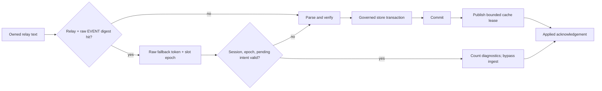

# Committed duplicate observation fast path

## Summary

Use a bounded, volatile post-commit observation cache to bypass repeated EVENT parsing and governed ingest while preserving exact fallback semantics.

## Boundaries

## Detailed Plan

## Objective

Make a same-relay replay of exact, already-durable EVENT bytes a bounded semantic no-op without weakening provenance, pending-write adoption, mutation ordering, diagnostics, backpressure, or recovery.

## Measured basis

Schema v11 now releases pass 2 only after pass 1 is applied and observes diagnostics at millisecond resolution. The raw EVENT-object ceiling reached a three-run median of 639,563 replay frames/s. Every second-pass frame hit; only first-pass EVENTs reached parsing, resolver, and store work. This is favorable evidence, not production proof, because diagnostic entries publish before commit.

## Production representation

- Locate the raw EVENT object before full `nostr::Event` construction and hash it with BLAKE3. Locator failure is always an ordinary-path miss.
- Key the cache by canonical `RelayUrl` identity and digest. Store `EventId`, kind, slot id, and monotonically changing slot epoch.
- Bound slots and maintain an EventId-to-slot reverse index so every canonical removal can invalidate all matching relay/digest entries.
- Move tungstenite's owned text into a hit token. The token carries the slot/epoch lease and retains exact bytes for engine-side fallback.

## Ordered protocol

1. A miss parses and verifies normally, carrying its digest candidate beside the owned Event.
2. Resolver ingest returns an input-aligned final-current disposition after the whole governed batch. Stale/refused or removed-in-batch events are ineligible.
3. After commit, invalidate removed EventIds, then publish eligible relay/digest entries.
4. A lookup hit still traverses bounded worker/translator/pool/engine queues.
5. The engine validates handle/session, cache slot epoch, and pending-intent conflict. Failure reparses retained text. Success increments exact kind diagnostics and bypasses resolver/store.
6. Mixed ordinary and hit frames are partitioned into ordered runs; hit tokens are barriers around commits/invalidation.
7. Cache publication completes before the existing applied acknowledgement. Crash before publication is a miss; restart clears the cache.

## Pending writes

Track active signed EventIds in the same synchronized cache authority. Register before publication or any relay side effect. A hit for an active ID falls back so store duplicate handling can satisfy the durable owner. Engine revalidation closes a worker-lookup race. Remove the active marker only after adoption or terminal compensation is durable.

## Validation

- Same relay and exact payload hits even with another subscription id.
- Another relay misses and grows provenance.
- Any payload-byte change misses and verifies normally.
- Eviction and restart miss safely.
- Tokens captured before deletion, replacement, expiry, or compensation fail epoch validation and fall back.
- Both wire orderings around kind:5 and replacement remain exact.
- A pending intent created between lookup and application forces fallback and adoption.
- Stale transport generations neither count nor ingest.
- Crash seams cannot publish before Redb commit.
- Normal hits produce zero Event parses, signature checks, resolver materializations, and store transactions while every frame remains in diagnostics.

Run `cargo test -p nmp-transport`, `cargo test -p nmp-resolver`, `cargo test -p nmp-engine`, the architecture gates, and the representative production matrix. Selection requires three fresh replay runs at or above the epic gate plus unchanged exact reopen, one-million persistence, query latency, RSS, and initial-ingest acceptance.

## Rollback and migration

The cache is volatile and has no persistent schema. Rollback removes the optimization; all inputs use the existing exact path. No data migration or SDK compatibility layer exists.

## Observability

Retain separate counters for eligible publications, hits, invalidated/stale leases, pending conflicts, locator misses, fallbacks, avoided parses, and avoided governed transactions. Report them in the versioned production probe only; do not add a public diagnostic noun in this issue.

## Stop criteria

Close the hypothesis negative if the production-safe three-run replay median misses the gate, if first-seen ingest regresses beyond the epic allowance, or if exact fallback requires an unbounded cache/raw-frame queue. Identify the remaining measured owner rather than weakening an invariant.

## Rule And ADR Check

- Issue-first discipline is satisfied by #663 under epic #612; the issue captures the performance consequence and correctness invariants.
- The event store remains internally atomic; cache publication occurs only after governed commit and the cache is volatile, so restart is a safe miss.
- The Noun Gate is preserved: all candidate, lease, epoch, and invalidation types remain internal to transport/engine/resolver.
- The existing bounded queues, session-generation checks, diagnostics, and applied acknowledgement remain in the hit path.
- No FFI, Swift, Kotlin, supported Rust facade, or surface snapshot changes are planned.

## Possible Rule Or ADR Loosening

- No repository rule or correctness invariant needs loosening. The cache is an optimization below the existing authority boundary, not a second event authority.

## Possible Rule Tightening

- Consider recording one durable internal invariant: a bypass token is valid only while its cache slot epoch is current and no local pending owner requires adoption; every failed validation must retain an exact raw fallback.

## Alternatives Considered

- Store-only duplicate shortcut: rejected because measured parsing, materialization, and bridge work remain far above the replay budget.
- EventId-only cache: rejected because an unverified ID cannot authorize a preparse bypass and a different relay must still grow provenance.
- Persist the cache: rejected because volatility makes crash recovery a safe miss and avoids another authority or migration surface.
- Suppress duplicate frames in transport: rejected because engine diagnostics, generation checks, pending-intent adoption, and ordered invalidation must remain exact.
- Change storage engines first: retained as separate issue #658, but it cannot address the measured duplicate parse/materialization path.

## Certainty

78 percent.

## Decision

ready

## Hosted Artifacts

- Plan page: Generated after publishing.

- TTS audio: https://blossom.primal.net/e292e40981742c35f5f4e68ed4d477c3e37bfaefaad13f1d6dd2e29ca0d5acb0.mp3
